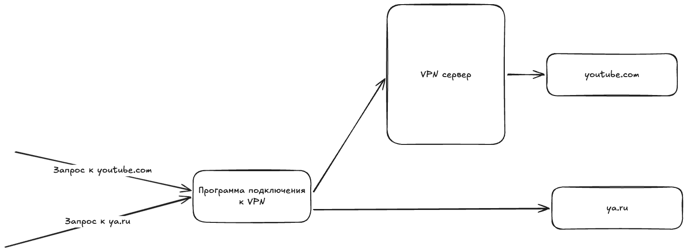

# Гайд по настройке VPN-клиентов и точечному обходу блокировок

> **⚠️ Дисклеймер:** 
> 
> Данный репозиторий несет исключительно образовательный характер. Инструкции предназначены для обеспечения личной информационной безопасности и удобной маршрутизации трафика.


Добро пожаловать в руководство по настройке VPN-клиентов и сплит-туннелирования. Этот репозиторий создан для тех, у кого уже есть доступ к современному VPN, и кто хочет настроить его максимально удобно и эффективно.

Главная цель гайда — сделать так, чтобы **заблокированные ресурсы открывались через VPN**, а **остальные сервисы работали напрямую**, без выключения VPN.

---

## Зачем нужно раздельное туннелирование?

**Проблема**

Российские сайты и приложения (банки, маркетплейсы и прочие) научились распознавать включённый VPN на устройстве пользователя. Собранные данные могут систематизироваться и передаваться в РКН для выявления узлов обхода блокировок.

**Решение**

Нужно указать клиенту (программе подключения к VPN), на какие сайты заходить через VPN, а на какие — напрямую. Таким образом при работе с российскими сайтами и приложениями VPN задействован не будет.



> **Что будет, если не настроить раздельное туннелирование?**
>
> IP-адрес вашего зарубежного VPN-сервера будет быстро скомпрометирован. В результате сервер попадет под блокировку, и **VPN попросту перестанет работать**. Придется искать и настраивать новый сервер.

---

## Как не скомпрометировать свой VPN

Даже при правильной настройке существует риск компрометации IP-адреса вашего сервера. Чтобы ваш VPN жил долго и не блокировался ТСПУ, соблюдайте три главных правила:

1. **Не открывайте российские сайты через VPN без раздельного туннелирования**

Если вы используете VPN на устройстве, где *еще не настроено* раздельное туннелирование, обязательно закрывайте вкладки с Госуслугами, банками и Яндексом перед включением VPN. Иначе трафик до этих сервисов пойдет через ваш сервер, и его IP-адрес будет быстро зафиксирован системами РКН.

2. **Осторожнее с нативными российскими приложениями**

Старайтесь не использовать десктопные или мобильные приложения российских сервисов одновременно с включенным VPN, *даже если у вас настроено раздельное туннелирование*. 
*Почему?* В отличие от браузеров, нативные приложения имеют глубокий доступ к операционной системе. Они могут игнорировать правила маршрутизации, использовать жестко зашитые DNS или собирать телеметрию обо всех активных сетевых адаптерах и отправлять эти данные разработчикам.

3. **По возможности используйте веб-версии вместо приложений**

Браузер работает в изолированной среде и строго подчиняется системным правилам маршрутизации, которые задает ваш VPN-клиент. Браузер не знает, какие сетевые интерфейсы работают в системе. Поэтому зайти в Сбербанк или Госуслуги через вкладку в браузере со включенным сплит-туннелированием — **полностью безопасно**, а вот через их отдельное приложение — риск.

---

## Шаг 1. Что требуется?

Чтобы воспользоваться инструкциями ниже, вам понадобится: одно из двух:
- **Для VLESS/Hysteria2**: Ключ доступа - строка, начинающаяся с `hy2://`, `vless://`.
- **Для AmneziaWG**: Конфигурационный файл `amnezia.conf`.

---

## Шаг 2. Настройка клиентов и маршрутизации

Выберите операционную систему, на которой хотите настроить подключение с раздельным туннелированием:

- [Windows](./vpn-client-setup/windows/)
- [macOS](./vpn-client-setup/macos/)
- [Android](./vpn-client-setup/android/)
- [iOS / iPadOS](./vpn-client-setup/ios)

В каждом из этих разделов вы найдете:
1. Какое приложение скачать.
2. Как добавить в него ваш ключ доступа.
3. **Как настроить правила маршрутизации**, чтобы VPN работал только там, где он нужен.

---

## 📂 Структура репозитория

```text
├── assets/                     # Изображения, скриншоты и файлы маршрутизации (гео-базы)
├── vpn-client-setup/           # Инструкции для пользовательских устройств
│   ├── android/                
│   ├── ios/                    
│   ├── macos/                  
│   └── windows/                
└── README.md                   # Этот файл
```

---

## 🤝 Вклад в проект

Интернет меняется каждый день. Если вы знаете новые рабочие клиенты, актуальные списки для маршрутизации или хотите помочь с разделами "в разработке" — создавайте *Issue* или отправляйте *Pull Request*. Будем улучшать гайд вместе!
