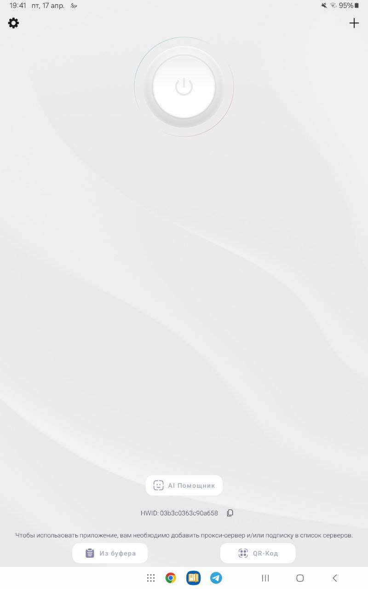
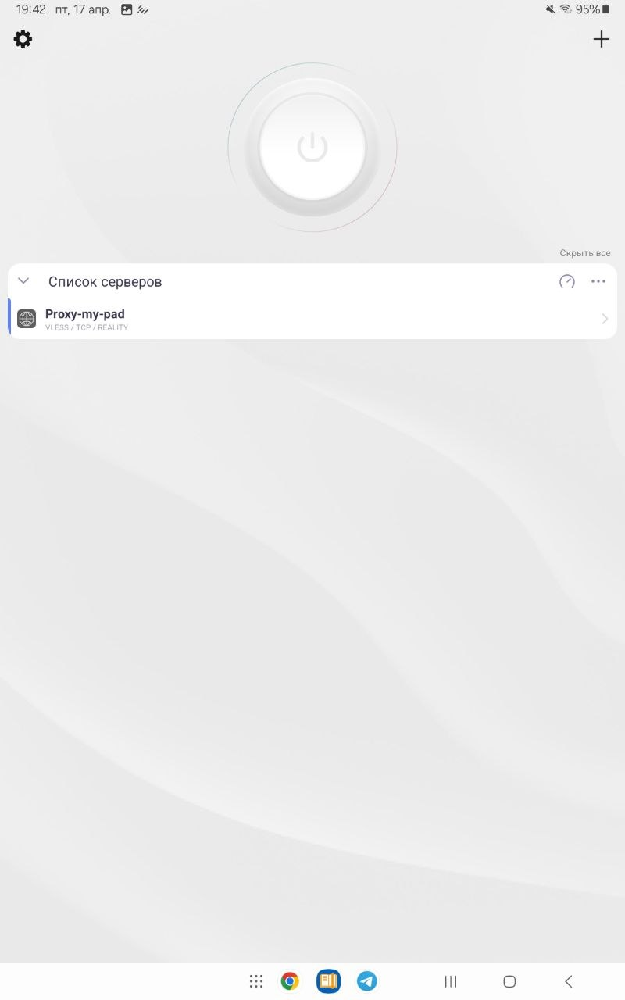
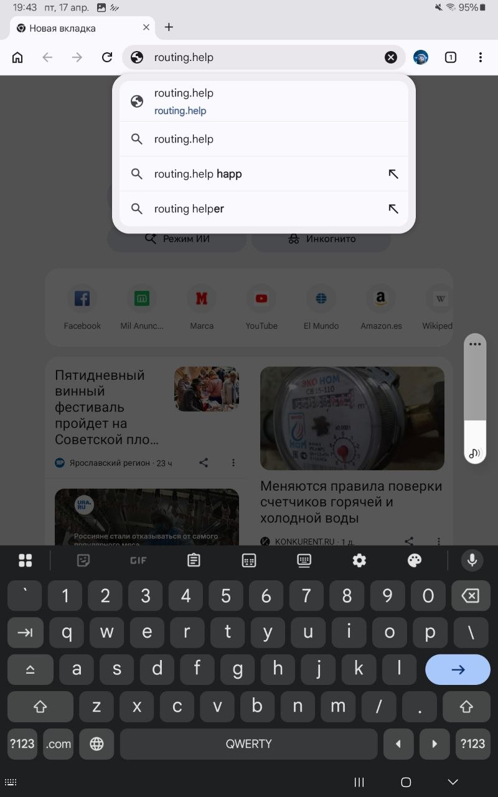
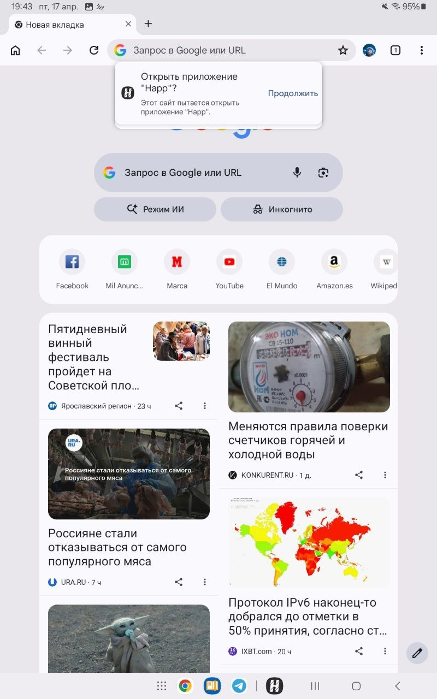
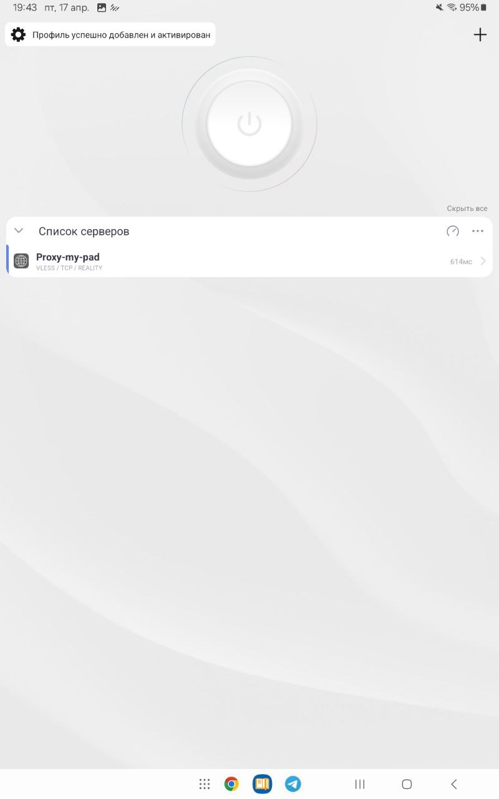
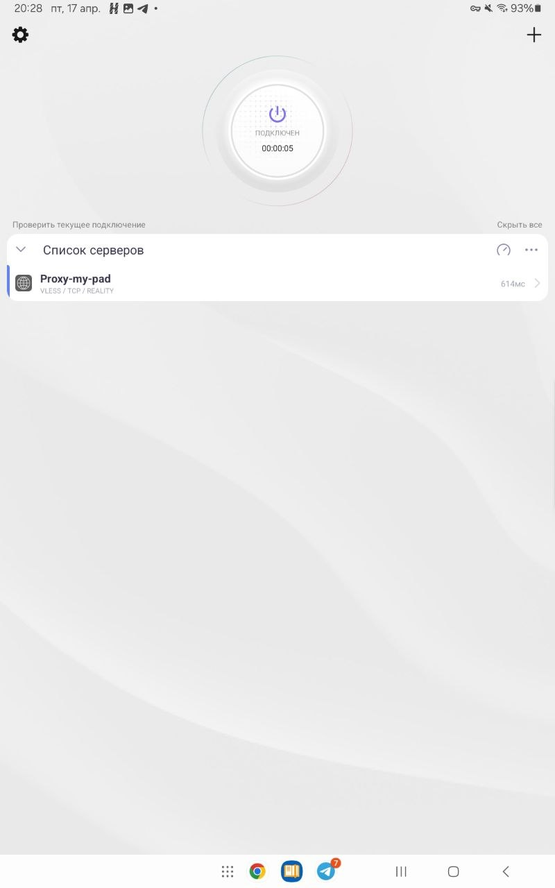

# Happ - клиент для подключения к VLESS

Для подключения к VLESS и Hysteria2 в Windows будем использовать **Happ**.

---

## Шаг 1. Установка

Скачиваем приложение из Google Play: 

https://play.google.com/store/apps/details?id=com.happproxy&hl=ru

---

## Шаг 2. Добавление ключа

Копируем ключ доступа (`hy2://...`, `vless://...`) в буфер обмена.

Заходим в приложение.

Нажимаем кнопку **Из буфера**. После этого должно появиться подключение.

---

## Шаг 3. Настройка раздельного туннелирования

Открываем веб-браузер и переходим по ссылке [routing.help](routing.help)

Соглашаемся на переход в приложение Happ.

Должно появиться уведомление, что профиль успешно добавлен.

---

## Шаг 4. Работа с VPN

Для подключения к VPN нажмите большую белую кнопку.

VPN работает! Можете проверять доступ к заблокированным ресурсам.

Для отключения от VPN нажмите большую белую кнопку ещё раз.

