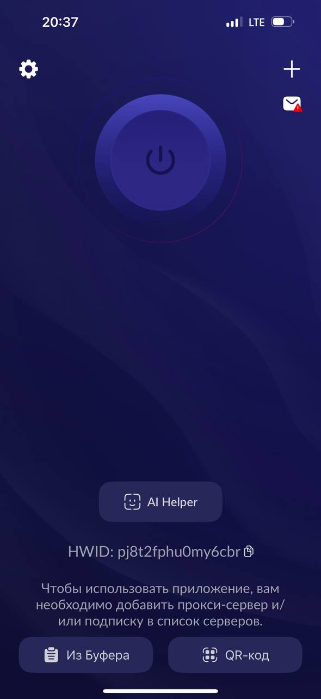
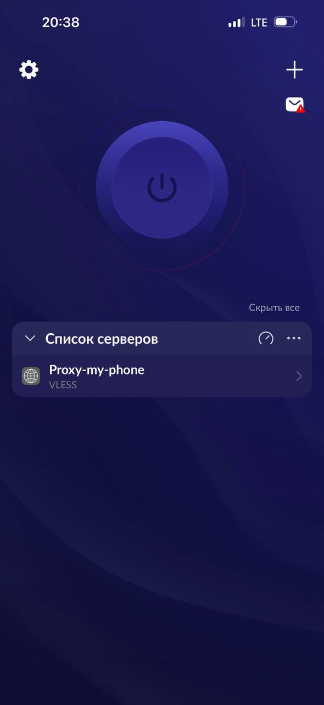
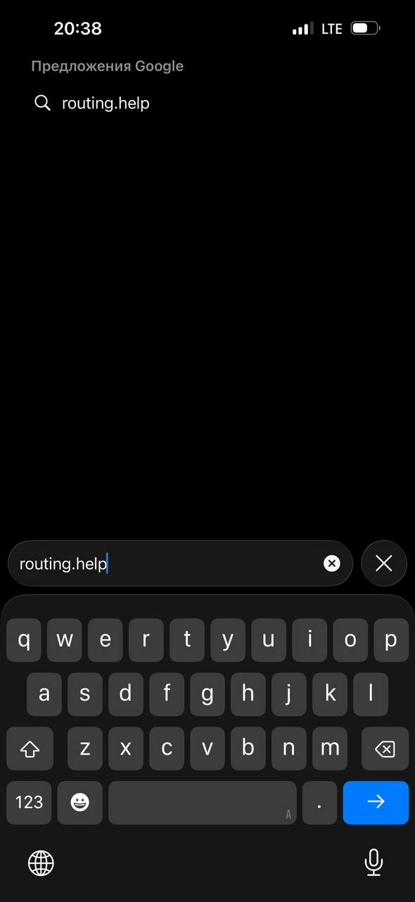
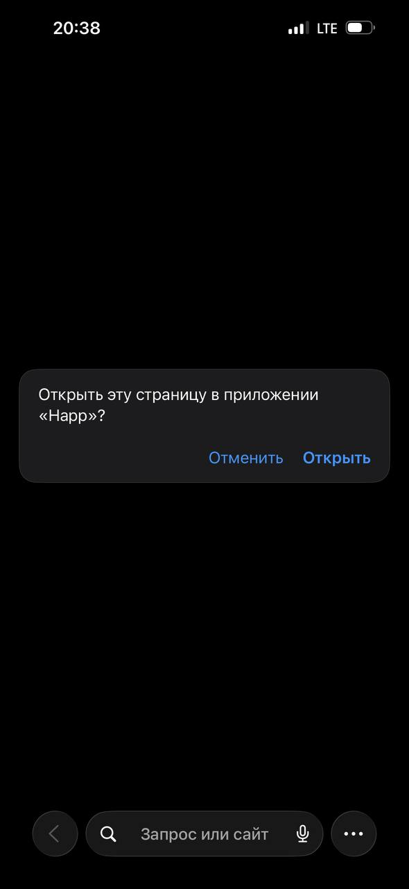
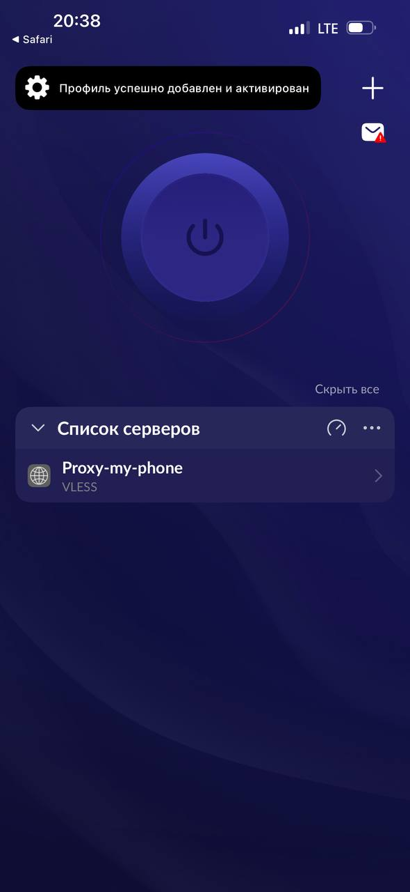
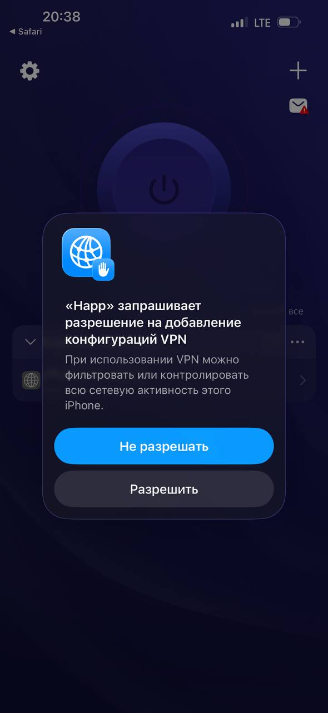
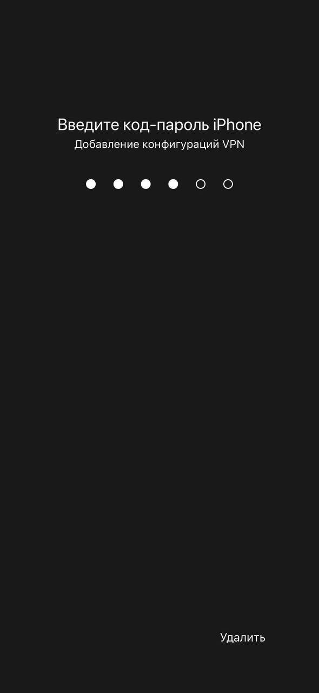
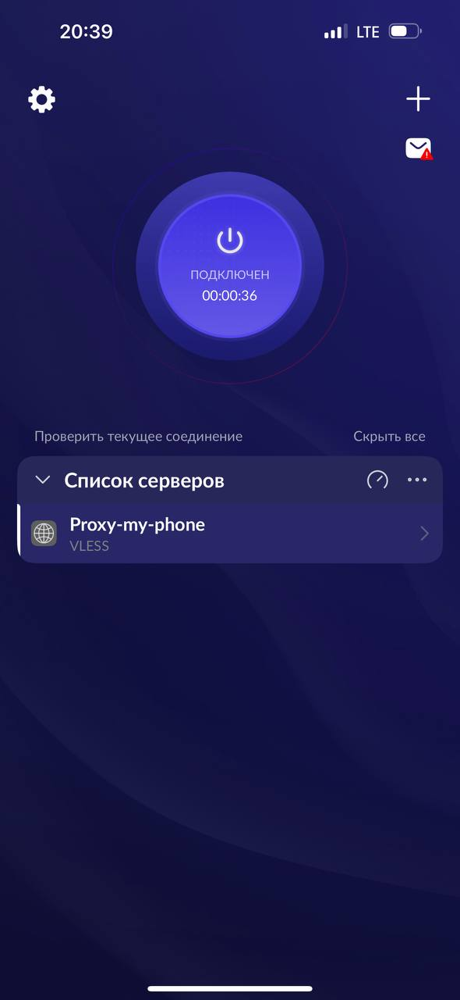

# Happ - клиент для подключения к VLESS

Для подключения к VLESS на iPhone и iPad будем использовать **Happ**.

## Шаг 1. Установка

Скачиваем приложение из AppStore: 

https://apps.apple.com/us/app/happ-proxy-utility

Если приложение недоступно - [смените регион AppStore](https://t-j.ru/apple-region/?utm_referrer=https%3A%2F%2Fwww.google.com%2F)

---

## Шаг 2. Добавление ключа

Копируем ключ доступа (`hy2://...`, `vless://...`) в буфер обмена.

Заходим в приложение.

Нажимаем кнопку **Из буфера**. После этого должно появиться подключение.

---

## Шаг 3. Настройка раздельного туннелирования

Открываем веб-браузер и переходим по ссылке [routing.help](routing.help)

Соглашаемся на переход в приложение Happ.

Должно появиться уведомление, что профиль успешно добавлен.

---

## Шаг 4. Работа с VPN

Для подключения к VPN нажмите большую кнопку.

Приложение запросит разрешение на добавление конфигурации VPN - соглашайтесь.

Введите пин-код от смартфона

После этого в приложении должно отображаться, что VPN подключён.

VPN работает! Можете проверять доступ к заблокированным ресурсам.

Для отключения от VPN нажмите большую кнопку ещё раз.
