# v2rayN - клиент для подключения к VLESS и Hysteria2

Для подключения к VLESS и Hysteria2 на macOS будем использовать [v2rayN](https://github.com/2dust/v2rayn).

## Шаг 1. Установка

Откройте последний релиз проекта (ниже надписи “Releases”).

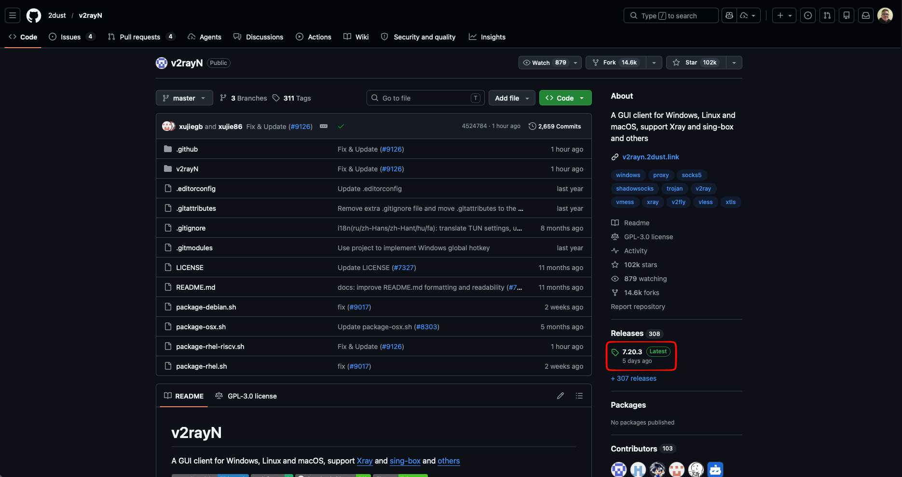

> ⚠️ Номер релиза может отличаться.

Пролистайте страницу вниз до тех пор, пока не увидите следующие строчки:

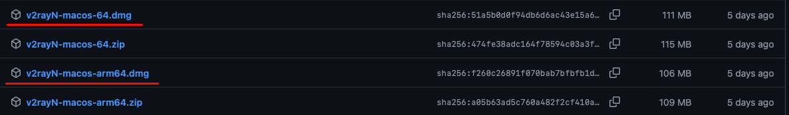

Нажмите на одну из двух ссылок загрузки .dmg файла.

- `v2rayN-macos-64.dmg` для компьютеров на процессорах Intel.
- `v2rayN-macos-arm64.dmg` для компьютеров на процессорах Apple Silicon.

После нажатия должна начаться загрузка.

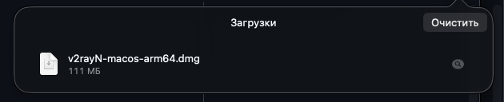

После окончания загрузки файла откройте его.

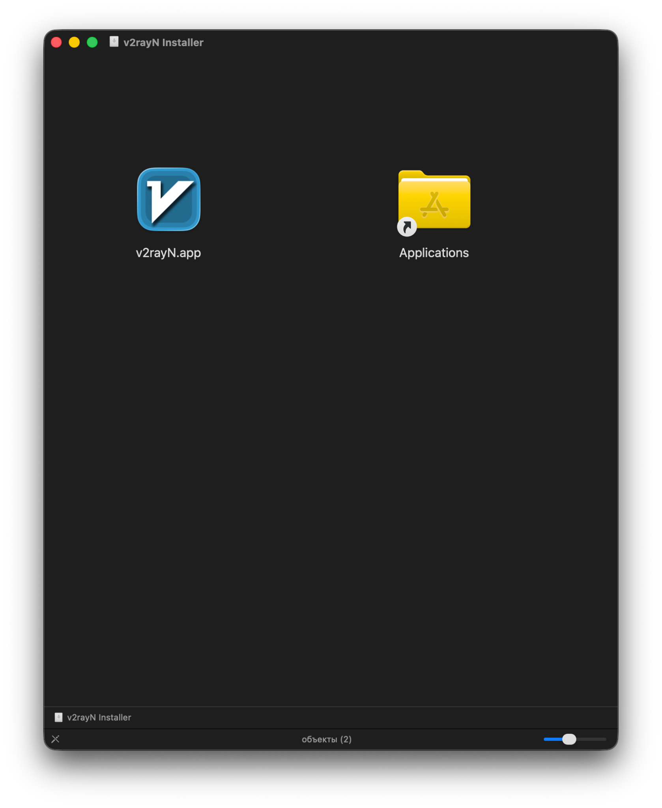

Откройте приложение v2rayN любым удобным способом. После открытия должно появиться окно.

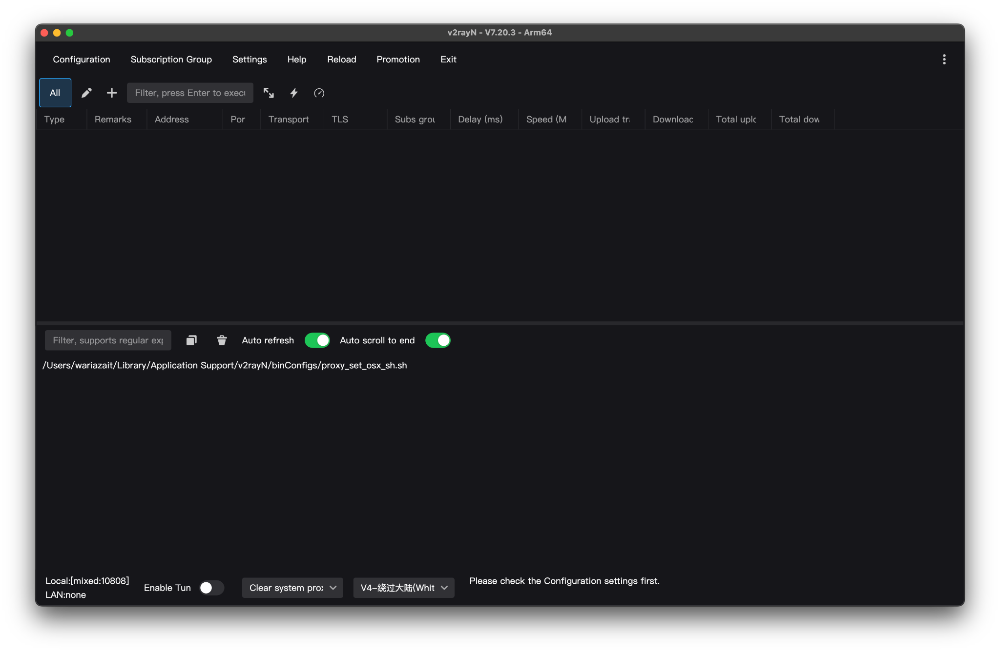

И икнока в трее.

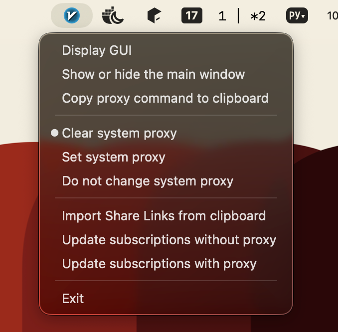

### Устранение проблем

При открытии v2rayN может появиться подобное сообщение

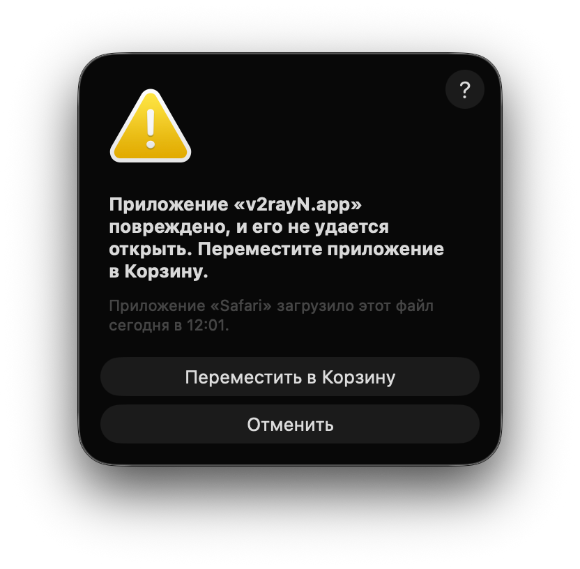

Нажимаем кнопку “Отменить”.

Открываем терминал и вводим туда команду:

```shell
sudo xattr -r -c /Applications/v2rayN.app/
```

Команда попросит ввести пароль пользователя. Вводим его.

> 💡 Важно:
>
> При вводе пароля в терминале символы не будут отображаться на экране — это нормальная защита macOS. Просто введите пароль вашей учетной записи вслепую и нажмите Enter.


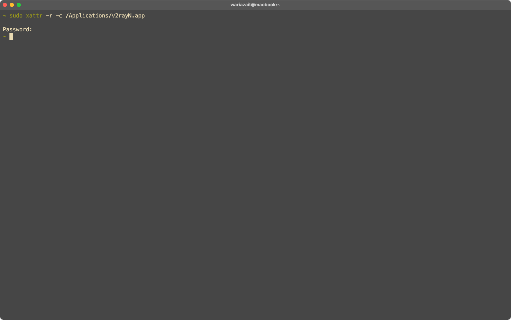

После этого приложение должно открыться.

## Шаг 2. Базовая настройка

Нажимаем на три точки справа сверху.

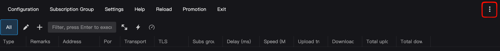

В поле Language выбираем пункт `ru`

Закрываем приложение сочетанием клавиш `Cmd + Q`.

Открываем приложение заново. Интерфейс должен быть переведён на русский язык.

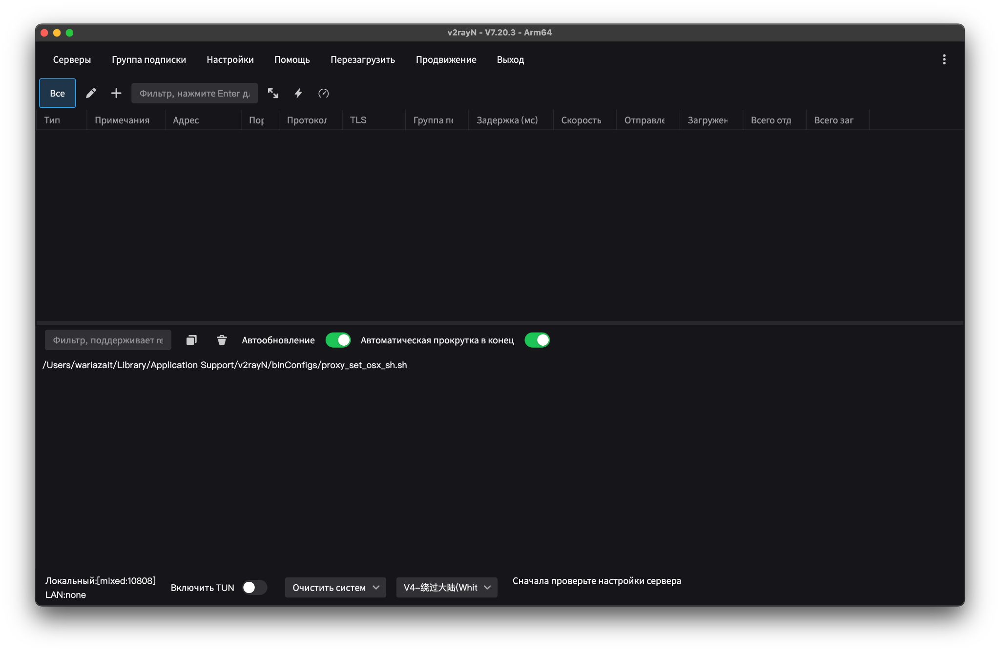

## Шаг 3. Настройка раздельного туннелирования

Для настройки раздельного туннелирования будем использовать готовые, регулярно обновляемые правила из репозитория [russia-v2ray-rules-dat](https://github.com/runetfreedom/russia-v2ray-rules-dat).

Это репозиторий с готовыми правилами маршрутизации трафика для РФ. Правила обновляются раз в 6 часов.

Установим правила в приложении. 

Открываем пункт: `Настройки -> Настройка региональных пресетов -> Россия`.

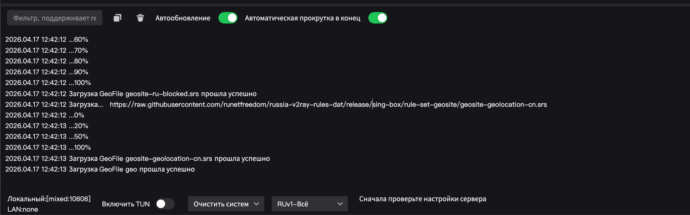

Ждём, пока установка правил закончится.

Активируем правила.

Открываем пункт: `Настройки -> Настройки маршрутизации`.

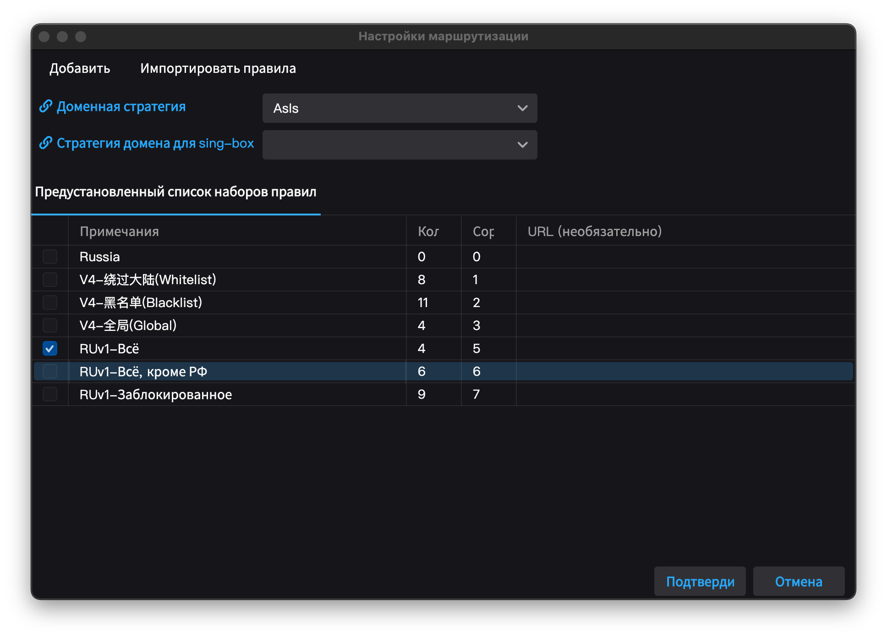

В открывшемся окне нажимаем ПКМ по пункту `RUv1-Всё, кроме РФ`.

В контекстном меню нажимаем пункт меню `Установить как активное правило`.

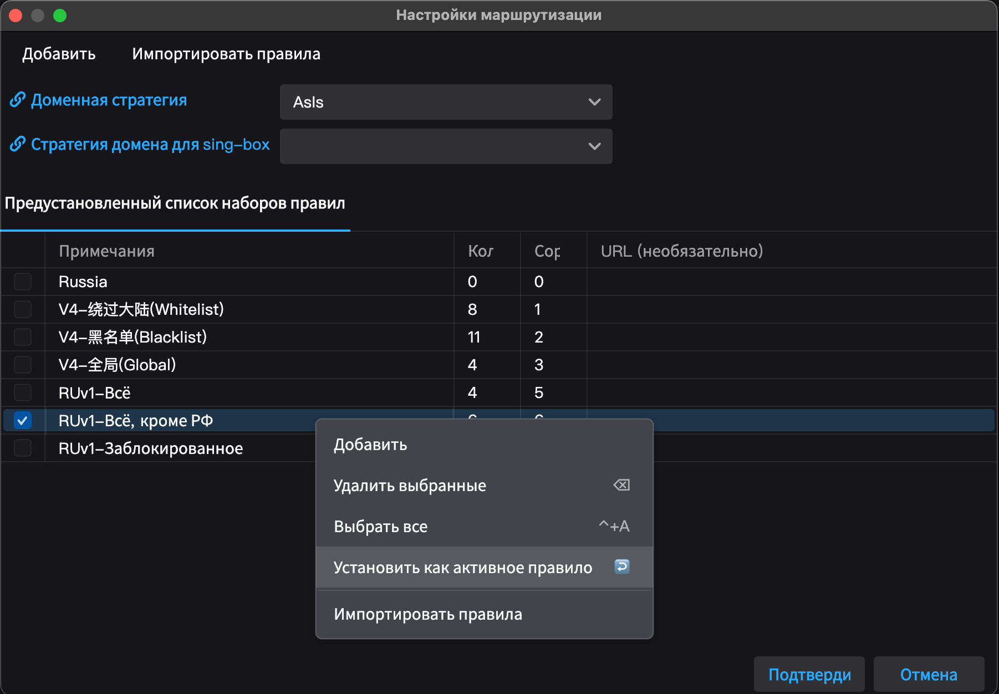

После настройки окно приложения можно закрыть. Если вы хотите открыть окно заново - его всегда можно вернуть с помощью меню в трее.

Нажимаем кнопку подтвердить. Правила маршрутизации настроены.

## Подключение к VLESS или Hysteria2 через ссылку

Копируем ключ доступа (`hy2://...`, `vless://...`) в буфер обмена.

Нажимаем ЛКМ в любом пустом пространстве в окне приложения. Нажимаем `Cmd + V`.

Должна появиться строчка с подключением подобная этой:

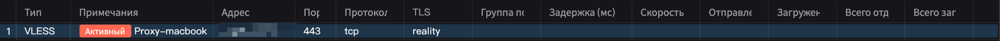

По умолчанию v2rayN работает как обычный системный прокси. Это значит, что через VPN пойдёт трафик только тех программ, которые умеют и «хотят» работать с прокси — в основном это браузеры. Однако многие другие приложения — десктопные мессенджеры, игры, терминал или фоновые службы обновлений — часто игнорируют системный прокси и продолжают выходить в сеть напрямую. Из-за этого часть заблокированных сервисов на компьютере может не работать, даже если VPN включен.

Режим TUN решает эту проблему. При его включении программа создает виртуальный сетевой адаптер на уровне операционной системы. В этом режиме v2rayN начинает работать как полноценный классический VPN: он принудительно перехватывает абсолютно весь интернет-трафик вашего компьютера, а уже затем применяет к нему правила раздельного туннелирования. Это гарантирует, что ни одна программа не сможет "проскочить" мимо ваших правил, и трафик будет корректно разделяться на заблокированные и российские ресурсы.

### Включение TUN-режима

В нижней панели активируем переключатель “Включить TUN”

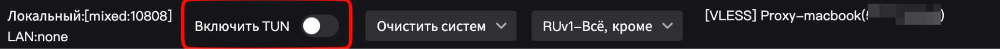

В открывшемся окне вводим пароль пользователя.

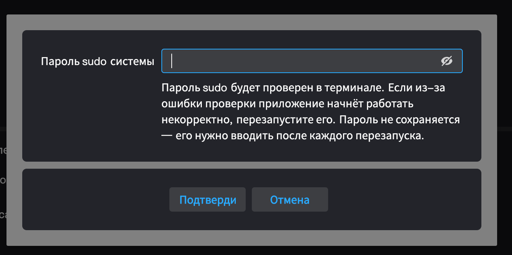

При использовании TUN-режима менять системный прокси необязательно, поэтому в соседнем меню выбираем пункт “Не менять системный прокси”.

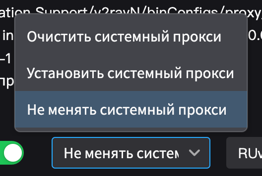

### Работа в режиме системного прокси

Если вы не планируете использовать TUN-режим, то выбирайте пункт “Установить системный прокси”.

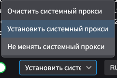

VPN подключён. Можете проверять доступ к заблокированным ресурсам.

