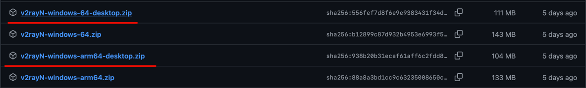
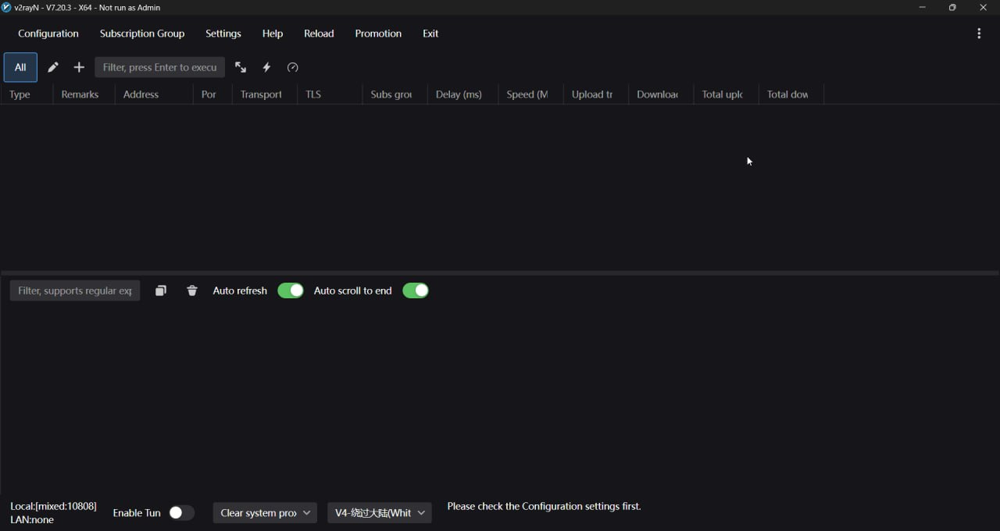
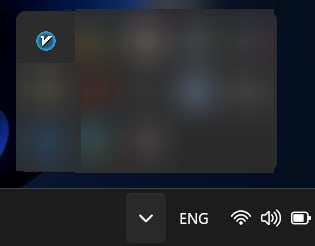
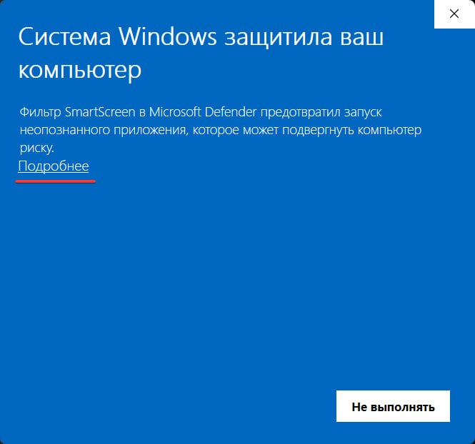
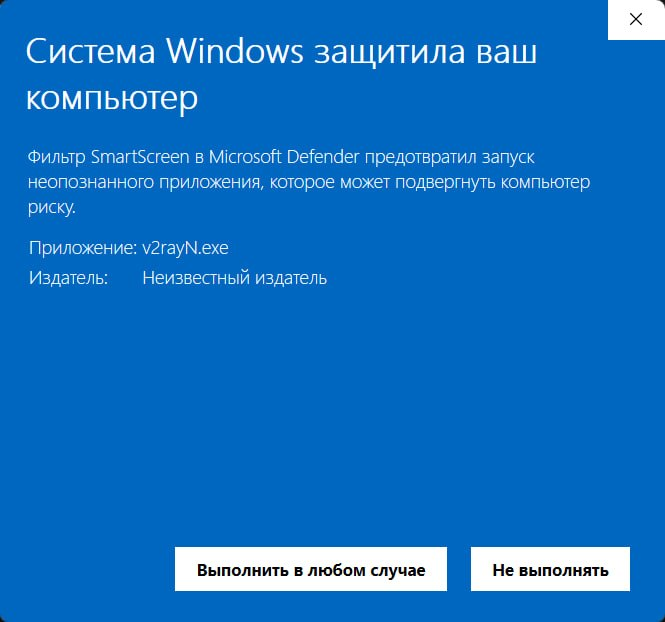
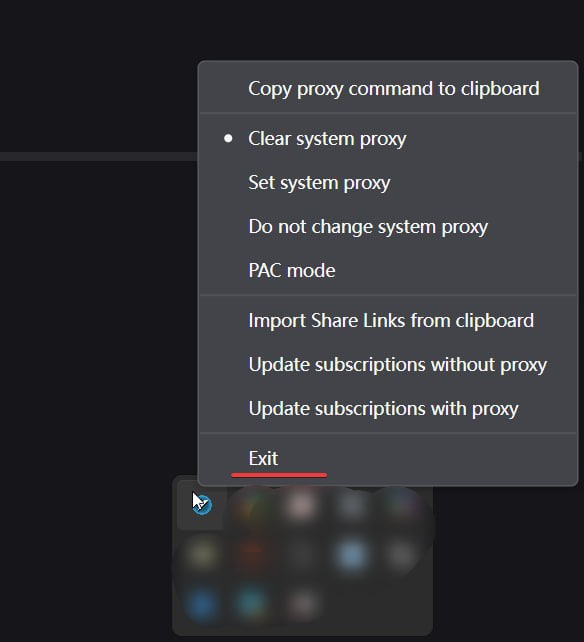
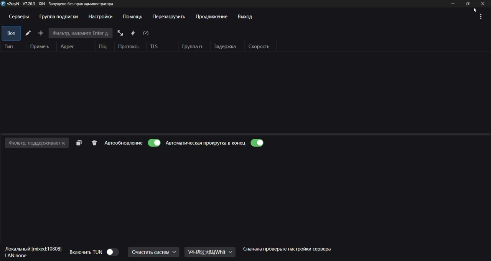
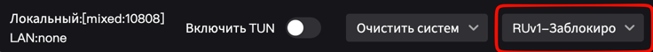

# v2rayN - клиент для подключения к VLESS и Hysteria2

Для подключения к VLESS и Hysteria2 в Windows будем использовать [v2rayN](https://github.com/2dust/v2rayn).

## Шаг 1. Установка

Откройте последний релиз проекта (ниже надписи “Releases”).

> ⚠️ Номер релиза может отличаться.

Пролистайте страницу вниз до тех пор, пока не увидите следующие строчки:

Нажмите на одну из двух ссылок загрузки .dmg файла.

- `v2rayN-windows-64-desktop.zip` для компьютеров на x86_64 процессорах.
- `v2rayN-windows-arm64-desktop.zip` для компьютеров на ARM процессорах.

После нажатия должна начаться загрузка.

Извлеките содержимое архива в любое удобное вам место и запустите файл `v2rayN-windows-64/v2rayN.exe`.

Должно открыться окно приложения.

Также должна появиться иконка приложения в трее.

### Устранение проблем

При открытии v2rayN может появиться подобное сообщение от Windows Defender:

Кликаем мышью на надпись `Подробнее`.

Нажимаем "Выполнить в любом случае". После этого приложение должно открыться.

## Шаг 2. Базовая настройка

Нажимаем на три точки справа сверху.

В поле Language выбираем пункт `ru`.

Нажимаем ПКМ по иконке приложения в трее. Нажимаем `Exit`.

Открываем приложение заново. Интерфейс должен быть переведён на русский язык.

## Шаг 3. Настройка раздельного туннелирования

Для настройки раздельного туннелирования будем использовать готовые, регулярно обновляемые правила из репозитория [russia-v2ray-rules-dat](https://github.com/runetfreedom/russia-v2ray-rules-dat).

Это репозиторий с готовыми правилами маршрутизации трафика для РФ. Правила обновляются раз в 6 часов.

Установим правила в приложении. 

Открываем пункт: `Настройки -> Настройка региональных пресетов -> Россия`.

Ждём, пока установка правил закончится.

Активируем правила.

В панели снизу открываем меню выбора правил маршрутизации:

Выбираем пункт меню `RUv1-Заблокированное`. Таким образом VPN будет применяться только к заблокированным ресурсам.

После настройки окно приложения можно закрыть. Если вы хотите открыть окно заново - его всегда можно вернуть с помощью меню в трее.

## Подключение к VLESS или Hysteria2 через ссылку

Копируем ключ доступа (`hy2://...`, `vless://...`) в буфер обмена.

Нажимаем ЛКМ в любом пустом пространстве в окне приложения. Нажимаем `Ctrl + V`.

Должна появиться строчка с подключением подобная этой:

По умолчанию v2rayN работает как обычный системный прокси. Это значит, что через VPN пойдёт трафик только тех программ, которые умеют и «хотят» работать с прокси — в основном это браузеры. Однако многие другие приложения — десктопные мессенджеры, игры, терминал или фоновые службы обновлений — часто игнорируют системный прокси и продолжают выходить в сеть напрямую. Из-за этого часть заблокированных сервисов на компьютере может не работать, даже если VPN включен.

Режим TUN решает эту проблему. При его включении программа создает виртуальный сетевой адаптер на уровне операционной системы. В этом режиме v2rayN начинает работать как полноценный классический VPN: он принудительно перехватывает абсолютно весь интернет-трафик вашего компьютера, а уже затем применяет к нему правила раздельного туннелирования. Это гарантирует, что ни одна программа не сможет "проскочить" мимо ваших правил, и трафик будет корректно разделяться на заблокированные и российские ресурсы.

### Включение TUN-режима

В нижней панели активируем переключатель “Включить TUN”

В этот момент программа попросит перезапустить себя от имени администратора. Соглашаемся.

При использовании TUN-режима менять системный прокси необязательно, поэтому в соседнем меню выбираем пункт “Не менять системный прокси”.

### Работа в режиме системного прокси

Если вы не планируете использовать TUN-режим, то выбирайте пункт “Установить системный прокси”.

VPN подключён. Можете проверять доступ к заблокированным ресурсам.
